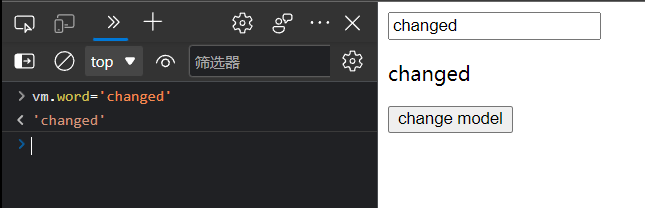
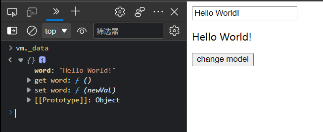
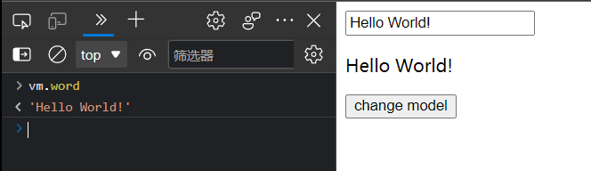

# 结课作业提交仓库

姓名：王顺昊
学校：南京大学
专业：软件工程
年级：大二
QQ：177117236

- 提交方式
fork 本仓库提交你的代码即可


# 一个简单的MVVM框架实现

> * Author:     王顺昊-201250085
> * School:     南京大学
> * CreateTime: 2022.07.18
> * EditTime:   2022.07.21

## 目录结构
[TOC]


## 需求
> 1. 实现数据劫持
> 2. 实现发布订阅模式
> 3. 实现数据单向绑定
> 4. 实现双向绑定
> 5. 项目要求
     >    1. 要有README
>    2. 使用JavaScript
>    3. 单测覆盖率80%

## 主要考查点
> 1. 代码可读性考察：命名、注释、代码组织结构
> 2. 设计能力：层次分明、抽象能力、可扩展性、数据封装

## 项目结构介绍

```bash
mvvm-master
    │  index.html            # 示例页面，基于我们实现的mvvm框架
    │  README_CN.md         # 本说明文档
    │
    ├─.idea
    │
    ├─css
    │      github.css
    │
    ├─img                   # 示例图片
    │      changed.png
    │      data.png
    │      word.png
    │
    ├─js
    │      compile.js       # 指令解析器Compile，对每个元素节点的指令进行扫描和解析，根据指令模板替换数据，以及绑定相应的更新函数
    │      mvvm.js          # mvvm入口函数
    │      observer.js      # 数据监听器Observer，能够对数据对象的所有属性进行监听，如有变动可拿到最新值并通知订阅者
    │      watcher.js       # Watcher，作为连接Observer和Compile的桥梁，能够订阅并收到每个属性变动的通知，执行指令绑定的相应回调函数，从而更新视图
    │
    └─vue-demo
            index.html      # vue语法下的示例页面
```


## 具体实现分析

在vue中，采用的是数据劫持结合发布者-订阅者模式的方式，通过`Object.defineProperty()`来劫持各个属性的`setter`，`getter`，在数据变动时发布消息给订阅者，触发相应的监听回调。

例如，下面这段html代码就是vue语法下的数据劫持示例：

```html
<div id="vue-app">
    <input type="text" v-model="word">
    <p>{{word}}</p>
    <button v-on:click="changeModel">change model</button>
</div>

<script src="http://cdn.bootcss.com/vue/1.0.25/vue.js"></script>
<script>
    let vm = new Vue({
        el: '#vue-app',
        data: {
            word: 'Hello World!'
        },

        methods: {
            changeModel: function() {
                this.word = 'Hi, this is a vue demo.';
            }
        }
    });
</script>
```

这里明确了对我们所需要或者可能更改的数据即`data`里的字符串`word`进行劫持，这样就实现了在页面中对`<input>`输入框内容修改时，自动同步修改页面上`<p>`标签对中的内容

我们在本项目中要做的就是模仿vue，实现一个mvvm框架

既然我们已经了解到vue是通过数据劫持的方式来做数据绑定的，其中最核心的方法便是通过`Object.defineProperty()`来实现对属性的劫持，达到监听数据变动的目的，无疑这个方法是本文中最重要、最基础的内容之一
整理如下，要实现mvvm的双向绑定，就必须要实现以下几点：
1. 实现一个数据监听器`Observer.js`，能够对数据对象的所有属性进行监听，如有变动可拿到最新值并通知订阅者
2. 实现一个指令解析器`Compile.js`，对每个元素节点的指令进行扫描和解析，根据指令模板替换数据，以及绑定相应的更新函数
3. 实现一个`Watcher.js`，作为连接`Observer.js`和`Compile.js`的桥梁，能够订阅并收到每个属性变动的通知，执行指令绑定的相应回调函数，从而更新视图
4. `mvvm.js`入口函数，整合以上三者


### 1. 数据劫持
> 定义：数据劫持，指的是在访问或者修改对象的某个属性时，通过一段代码拦截这个行为，进行额外的操作或者修改返回结果。

vue中是通过`Object.defineProperty()`来实现对属性的劫持，达到监听数据变动的效果。类似的，我们在`Observer.js`中也定义了相关方法如下

```javascript
Observer.prototype = {
    constructor: Observer,
    walk: function(data) {
        var me = this;
        Object.keys(data).forEach(function(key) {
            me.convert(key, data[key]);
        });
    },
    convert: function(key, val) {
        this.defineReactive(this.data, key, val);
    },

    defineReactive: function(data, key, val) {
        var dep = new Dep();
        var childObj = observe(val);

        Object.defineProperty(data, key, {
            enumerable: true, // 可枚举
            configurable: false, // 不能再define
            get: function() {
                if (Dep.target) {
                    dep.depend();
                }
                return val;
            },
            set: function(newVal) {
                if (newVal === val) {
                    return;
                }
                val = newVal;
                // 新的值是object的话，进行监听
                childObj = observe(newVal);
                // 通知订阅者
                dep.notify();
            }
        });
    }
};
```


### 2. 发布订阅
> 一般通过sub, pub的方式实现数据和视图的绑定监听，更新数据方式通常做法是 `vm.set('property', value)`

compile主要做的事情是解析模板指令，将模板中的变量替换成数据，然后初始化渲染页面视图，并将每个指令对应的节点绑定更新函数，添加监听数据的订阅者，一旦数据有变动，收到通知，更新视图

因为遍历解析的过程有多次操作dom节点，为提高性能和效率，会先将vue实例根节点的`el`转换成文档碎片`fragment`进行解析编译操作，解析完成，再将`fragment`添加回原来的真实dom节点中
```javascript
function Compile(el) {
    this.$el = this.isElementNode(el) ? el : document.querySelector(el);
    if (this.$el) {
        this.$fragment = this.node2Fragment(this.$el);
        this.init();
        this.$el.appendChild(this.$fragment);
    }
}
Compile.prototype = {
	init: function() { this.compileElement(this.$fragment); },
    node2Fragment: function(el) {
        var fragment = document.createDocumentFragment(), child;
        // 将原生节点拷贝到fragment
        while (child = el.firstChild) {
            fragment.appendChild(child);
        }
        return fragment;
    }
};
```


compileElement方法将遍历所有节点及其子节点，进行扫描解析编译，调用对应的指令渲染函数进行数据渲染，并调用对应的指令更新函数进行绑定，详看代码及注释说明：


```javascript
Compile.prototype = {
	// ... 省略
	compileElement: function(el) {
        var childNodes = el.childNodes, me = this;
        [].slice.call(childNodes).forEach(function(node) {
            var text = node.textContent;
            var reg = /\{\{(.*)\}\}/;	// 表达式文本
            // 按元素节点方式编译
            if (me.isElementNode(node)) {
                me.compile(node);
            } else if (me.isTextNode(node) && reg.test(text)) {
                me.compileText(node, RegExp.$1);
            }
            // 遍历编译子节点
            if (node.childNodes && node.childNodes.length) {
                me.compileElement(node);
            }
        });
    },

    compile: function(node) {
        var nodeAttrs = node.attributes, me = this;
        [].slice.call(nodeAttrs).forEach(function(attr) {
            // 规定：指令以 v-xxx 命名
            // 如 <span v-text="content"></span> 中指令为 v-text
            var attrName = attr.name;	// v-text
            if (me.isDirective(attrName)) {
                var exp = attr.value; // content
                var dir = attrName.substring(2);	// text
                if (me.isEventDirective(dir)) {
                	// 事件指令, 如 v-on:click
                    compileUtil.eventHandler(node, me.$vm, exp, dir);
                } else {
                	// 普通指令
                    compileUtil[dir] && compileUtil[dir](node, me.$vm, exp);
                }
            }
        });
    }
};

// 指令处理集合
var compileUtil = {
    text: function(node, vm, exp) {
        this.bind(node, vm, exp, 'text');
    },
    // ...省略
    bind: function(node, vm, exp, dir) {
        var updaterFn = updater[dir + 'Updater'];
        // 第一次初始化视图
        updaterFn && updaterFn(node, vm[exp]);
        // 实例化订阅者，此操作会在对应的属性消息订阅器中添加了该订阅者watcher
        new Watcher(vm, exp, function(value, oldValue) {
        	// 一旦属性值有变化，会收到通知执行此更新函数，更新视图
            updaterFn && updaterFn(node, value, oldValue);
        });
    }
};

// 更新函数
var updater = {
    textUpdater: function(node, value) {
        node.textContent = typeof value == 'undefined' ? '' : value;
    }
    // ...省略
};
```

这里通过递归遍历保证了每个节点及子节点都会解析编译到，包括了{{}}表达式声明的文本节点。指令的声明规定是通过特定前缀的节点属性来标记，如`<span v-text="content" other-attr`中`v-text`便是指令，而`other-attr`不是指令，只是普通的属性。
监听数据、绑定更新函数的处理是在`compileUtil.bind()`这个方法中，通过`new Watcher()`添加回调来接收数据变化的通知


### 3. 单向绑定
> 定义：把Model绑定到View，当我们用JavaScript代码更新Model时，View就会自动更新。因此，我们不需要进行额外的DOM操作，只需要进行Model的操作就可以实现视图的联动更新。

单向绑定较为简单，例如插值形式`{{data}}`的形式，它使用的就是单向绑定。

我们打开浏览器console，在控制台中输入`vm.word='changed'`并回车执行，可以看到页面立刻发生了变化。



MVVM框架会自动监听Model的任何变化，在Model数据变化时，更新View的显示。这种Model到View的绑定就是单向绑定。


### 4. 双向绑定
> 定义：把Model绑定到View的同时也将View绑定到Model上，这样就既可以通过更新Model来实现View的自动更新，也可以通过更新View来实现Model数据的更新。所以，当我们用JavaScript代码更新Model时，View就会自动更新，反之，如果用户更新了View，Model的数据也自动被更新了。

所谓双向绑定，指的是mvvm实例中的data与其渲染的DOM元素的内容保持一致，无论谁被改变，另一方会相应的更新为相同的数据。这是通过设置属性访问器实现的。

双向绑定主要用在表单的input输入框，完成视图和数据的双向绑定。

我们可以在表单中输入内容，然后在浏览器console中用`vm._data`查看Model的内容


也可以用`vm.word`查看Model的`word`属性，它的值和FORM表单对应的`<input>`是一致的。


如果在浏览器console中用JavaScript更新Model，例如，执行`vm.word='changed'`，表单对应的`<input>`内容就会立刻更新。


可以看到通过v-model实现了表单数据和Model数据的双向绑定。


## 单元测试

本项目实现了一个MVVM框架，由于个人水平能力有限，尝试使用jest测试效果不显著。但经过手动测试功能正常，测试用例覆盖率无法计算。